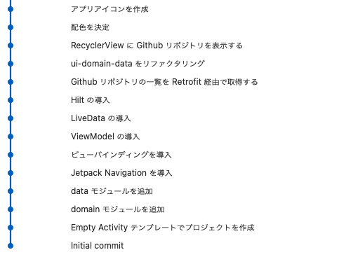

# hello-architecture-retrofit

Android 推奨アーキテクチャと Retrofit を使い、Github リポジトリの検索結果を RecyclerView に表示する。

## 構成

* MVVM アーキテクチャパターン  
  ViewModel + LiveData + ビューバインディング

* [Android 推奨のアーキテクチャ](https://developer.android.com/jetpack/guide?hl=ja) に準拠  
  UI Layer -> Domain Layer -> Data Layer

* [クリーンアーキテクチャ](https://www.amazon.co.jp/exec/obidos/ASIN/4048930656/maple036-22/) に準拠  
  Use Case / Controllers & Gateways & Presenters / External Interface .etc

## Dependencies

* 通信ライブラリ  
  [Retrofit](https://square.github.io/retrofit/)

* DI(依存性の注入)ライブラリ  
  [Hilt](https://dagger.dev/hilt/) 
  
* JSON <=> String 変換ライブラリ  
  [Gson](https://github.com/google/gson) 

* イメージロードライブラリ  
  [Glide](https://github.com/bumptech/glide)  

## Commit Tree

