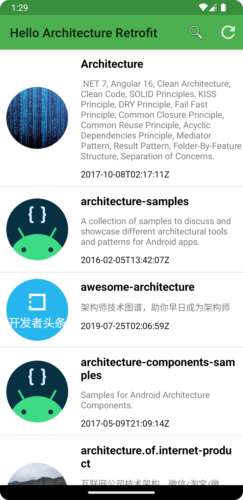
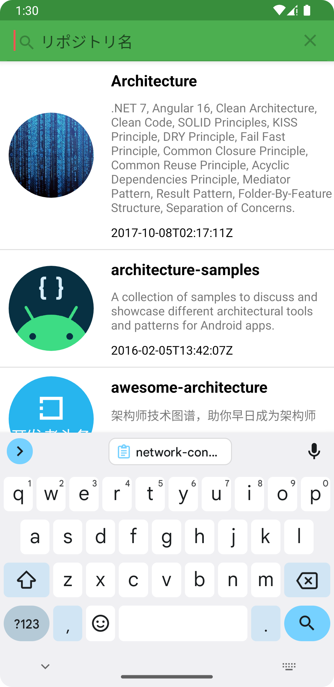
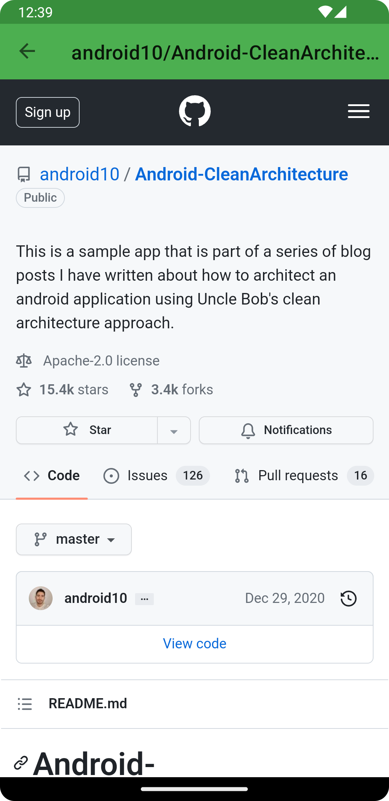

[Android 推奨のアーキテクチャ](https://developer.android.com/jetpack/guide?hl=ja) と [Retrofit](https://square.github.io/retrofit/) のサンプルコード。

# hello-architecture-retrofit

Android 推奨アーキテクチャと Retrofit を使い、Github リポジトリの検索結果を RecyclerView に表示する。

### Technology Stack

#### アーキテクチャ

|項目   |説明                                     |
|-------|----------------------------------------|
|MVVM   |ViewModel + LiveData + ビューバインディング|
|[Android 推奨のアーキテクチャ](https://developer.android.com/jetpack/guide?hl=ja)| UI Layer -> Domain Layer -> Data Layer |
|[クリーンアーキテクチャ](https://www.amazon.co.jp/exec/obidos/ASIN/4048930656/maple036-22/)| Use Case / Controllers & Gateways & Presenters / External Interface .etc |

#### Dependencies

|項目   |説明                                     |
|-------|----------------------------------------|
|[Retrofit](https://square.github.io/retrofit/)|通信ライブラリ|
|[Hilt](https://dagger.dev/hilt/) |DI(依存性の注入)ライブラリ|
|[Gson](https://github.com/google/gson)|  Googleが提供するJSONデータとJavaオブジェクトを相互に変換するためのライブラリ|
|[Moshi](https://github.com/square/moshi/tree/master)|JavaやAndroid向けのモダンなJSONライブラリ|
|[Glide](https://github.com/bumptech/glide)|イメージロードライブラリ |

### 画面のスクリーンショット

　　　　

### Commit Tree

|コミット |
|----------------|
|[Empty Activity テンプレートでプロジェクトを作成](https://github.com/seabat/hello-architecture-retrofit/commit/e29a4a2ad0fcbfc1f18b4eb428fc529975417283) |
|[domain モジュールを追加](https://github.com/seabat/hello-architecture-retrofit/commit/81cc0cc532199b5ab1c7e0a05d5cec0a7855dc67)|
|[data モジュールを追加](https://github.com/seabat/hello-architecture-retrofit/commit/1f2bfd249257ae535627cfa4a64880636cf1f031)|
|[Jetpack Navigation を導入](https://github.com/seabat/hello-architecture-retrofit/commit/aefd37f43202f0b6fa0cc9a2527c3f10f89f371c)|
|[ビューバインディングを導入](https://github.com/seabat/hello-architecture-retrofit/commit/9b12403ee3b6ca89d69b13582f673fb0bee7cbb1)|
|[ViewModel の導入](https://github.com/seabat/hello-architecture-retrofit/commit/c9b50c3b952aa75fb7e1d90f286e19a757234b01)|
|[LiveData の導入](https://github.com/seabat/hello-architecture-retrofit/commit/60a6ac04943e3419d7c6b9416eb8375240f9ebdd)|
|[Hilt の導入](https://github.com/seabat/hello-architecture-retrofit/commit/8687ae023e502c6b7e4fb6cd74e05ab36c043062)|
|[Github リポジトリの一覧を Retrofit 経由で取得する](https://github.com/seabat/hello-architecture-retrofit/commit/2da1e66064d8eee1aeb4eea924ee127af60a4bb4)|
|[RecyclerView に Github リポジトリを表示する](https://github.com/seabat/hello-architecture-retrofit/commit/4dac6e143f588aecf1ae64481f7a15423592518e)|
|[配色を決定](https://github.com/seabat/hello-architecture-retrofit/commit/bae834f9518c4f3e3ff64ba2752ced8e08ee26f4)|
|[アプリアイコンを作成](https://github.com/seabat/hello-architecture-retrofit/commit/058ede5789b51480eb2f7a6228f57aa48d4ecd68)|
|[Retrofit のエラーハンドリングを追加](https://github.com/seabat/hello-architecture-retrofit/commit/7c958ddaabf42cecdee35962579f2ebf6696981c)|
|[汎用のシンプルなエラーダイアログを追加](https://github.com/seabat/hello-architecture-retrofit/commit/c2c4f036825640aab138dcb14727eaf711308160)|
|[デフォルトのアプリバーを Toolbar に変更する](https://github.com/seabat/hello-architecture-retrofit/commit/9e1e8ba8c305514094a199a725b890122d4e0f9e)|
|[Toolbar にメニューを配置する](https://github.com/seabat/hello-architecture-retrofit/commit/52d1eef0699d4627189a00eedd245e2a5247b821)|
|[アプリバーに検索ビューを配置する](https://github.com/seabat/hello-architecture-retrofit/commit/6ddfe4069e2ca3d43938cdcc2ab95a85f338a324)|
|[検索・更新処理を実装](https://github.com/seabat/hello-architecture-retrofit/commit/18a6ae42927b49c80db55f6de1310451ab4ed9c1)|
|[README に画面のスクショを追加](https://github.com/seabat/hello-architecture-retrofit/commit/9b8b8714e201736fc558cfaf280b568a828b2e55)|
|[リポジトリ詳細画面を追加する](https://github.com/seabat/hello-architecture-retrofit/commit/b6cd8f50c18db6c2bbaf6c65be0df9185df329d6)|
|[リポジトリ詳細画面のヘッダーに戻るボタンを追加する](https://github.com/seabat/hello-architecture-retrofit/commit/0cc803a8ce51dcf0b8fe9f0e0dc5ae10381a897d)|
|[リポジトリ詳細画面にパラメータを渡して遷移する](https://github.com/seabat/hello-architecture-retrofit/commit/daf403f5e802d9e6a511a04d176086e537656c41)|
|[レスポンスJSON のパースをGson から Moshi に変更](https://github.com/seabat/hello-architecture-retrofit/commit/85fa9818128854db45d2b003bfc7da13f5ecdd9f)|
|[JSON のパースをGSON から Moshi に変更](https://github.com/seabat/hello-architecture-retrofit/commit/3f2d3b91a4ded7c430c669d6c1f13f7509c84e36)|
|[HTTP 通信を非同期方式から同期方式に変更する](https://github.com/seabat/hello-architecture-retrofit/commit/14be2045b72a2b0f76149e6d2e0ba01e5de05f8a)|

# paging-architecture-retrofit

hello-architecture-retrofit に [Jetpack Paging](https://developer.android.com/topic/libraries/architecture/paging/v3-overview) を適用。

GitHub API 「[Search repositories](https://docs.github.com/ja/rest/search/search?apiVersion=2022-11-28#search-repositories)」はページングに対応しており、1度のアクセスで1ページ分しか取得できない仕様である。 Jetapack Paging を使用してリストの無限スクロールを実装する。

※ [Search repositories](https://docs.github.com/ja/rest/search/search?apiVersion=2022-11-28#search-repositories)」の1ページ分は (30(Default)件から100件(MAX)。

### Technology Stack

#### アーキテクチャ

|項目   |説明                                     |
|-------|----------------------------------------|
|MVVM   |ViewModel + LiveData + ビューバインディング|
|[Android 推奨のアーキテクチャ](https://developer.android.com/jetpack/guide?hl=ja)| UI Layer -> Domain Layer -> Data Layer |
|[クリーンアーキテクチャ](https://www.amazon.co.jp/exec/obidos/ASIN/4048930656/maple036-22/)| Use Case / Controllers & Gateways & Presenters / External Interface .etc |

#### Dependencies

|項目   |説明                                     |
|-------|----------------------------------------|
|[Retrofit](https://square.github.io/retrofit/)|通信ライブラリ|
|[Hilt](https://dagger.dev/hilt/) |DI(依存性の注入)ライブラリ|
|[Gson](https://github.com/google/gson)|  Googleが提供するJSONデータとJavaオブジェクトを相互に変換するためのライブラリ|
|[Moshi](https://github.com/square/moshi/tree/master)|JavaやAndroid向けのモダンなJSONライブラリ|
|[Glide](https://github.com/bumptech/glide)|イメージロードライブラリ |
|[Paging3](https://developer.android.com/topic/libraries/architecture/paging/v3-overview)|ページング処理を楽に実装するためのライブラリ|

### Commit Tree

|コミット |
|----------------|
|[PagingSource を作成](https://github.com/seabat/hello-architecture-retrofit/commit/72c5078bd8a36ca70927ffa78f8802f104da0934) |
|[ViewModel から PagingData を公開する](https://github.com/seabat/hello-architecture-retrofit/commit/ad6f67cf5ce22241da48e710fb54a6f1db248050)|
|[PagingDataAdapter を作成](https://github.com/seabat/hello-architecture-retrofit/commit/7828f9fb9777c2f9fb35961174c64838c0c12d70)|
|[Fragment で PagingDataAdapter を更新する](https://github.com/seabat/hello-architecture-retrofit/commit/bfa23674a9bfd8c01af040345cd891c1f82b5638)|
|[エラーダイアログを表示する](https://github.com/seabat/hello-architecture-retrofit/commit/357bf14a2c59ea025d2681d5ce44f9ec42a27ce4)|
|[プログレスバーを表示する](https://github.com/seabat/hello-architecture-retrofit/commit/827d6f8429a611afd31f890ab4fd87686862b6cc)|
|[リストを更新する](https://github.com/seabat/hello-architecture-retrofit/commit/fd7b0d622dee90524c94fe1a08354dc97360027e)|

